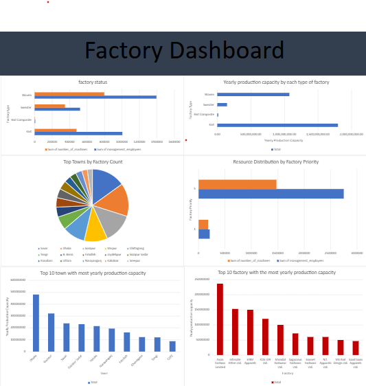

# Bangladesh Garments Industry Data Analysis

## Project Overview
This project provides an end-to-end data analysis of the Bangladesh garments sector. It involves cleaning raw data and filtering anomalies using SQL, followed by aggregating and building a comprehensive visual dashboard in Excel to track factory capacities, resource distribution, and regional densities.

## Dashboard Preview
Below is the final reporting dashboard generated from the polished dataset:

## Core Insights
* **Regional Dominance:** Dhaka and Gazipur lead the sector with the highest overall yearly production capacities.
* **Resource Allocation:** Woven and Knit factory types handle the highest volume of management employees and active machinery.
* **Data Integrity:** Handled data anomalies (such as separating out profiles with zeroed production capacities) via SQL prep before visualization.

## Tools & Skills Used
* **SQL:** Data exploration, handling missing values, and query aggregations.
* **MS Excel / Google Sheets:** Pivot Tables, data modeling, custom sorting, and dashboard UI design.

## Repository Files
* `your_sql_queries.sql` - The backend SQL scripts used for data extraction and preparation.
* `garments_tab.xlsx` - The workbook containing the underlying Pivot Tables and data models.
* `garments_tab_chart_2.pdf` - A clean, presentation-ready PDF export of the visual dashboard.
